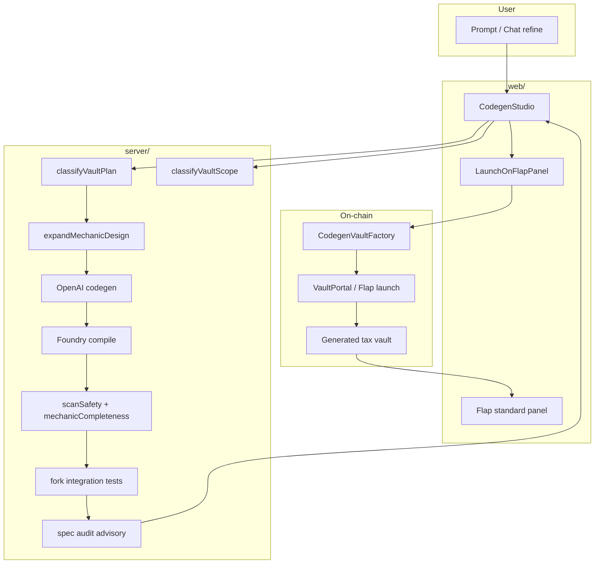

# Flap Vault Gen — Project Overview

**Flap Vault Gen is v0 for tax vaults** — describe a vault mechanic in plain English, get audited-ish Solidity, iterate in chat, and launch on Flap.

This document explains **what the project is**, **what exists today**, **where it falls short of the vision** (Cursor / v0 for vaults), and **how the pieces fit together** with code references.

---

## 1. Vision (north star)

| Goal | Description |
|------|-------------|
| **Product** | Any vault idea → working product on Flap |
| **UX** | Like Cursor or v0: describe → preview → iterate → ship when ready |
| **Safety** | Automated gates so broken contracts don't launch silently |
| **UI surface** | Flap's **standard panel** (auto-generated from `vaultUISchema()`) for most vaults |

**Reality today:** The studio reliably ships **Flap Tax Vault V2** products (tax BNB → buckets → user/manager mechanics). It does **not** yet ship arbitrary product classes (dual-token curves, custom trading UIs, NFT mints) without honest warnings and approximations.

---

## 2. What the project is

Flap Vault Gen is a **full-stack AI codegen pipeline** for Flap protocol vaults:

```
User prompt (plain English)
    → classify vault kind + scope check
    → design mechanic lifecycle (novel prompts)
    → LLM writes Solidity (child of CodegenVaultBase)
    → Foundry compile
    → safety + mechanic-completeness scanners
    → mainnet-fork integration tests
    → advisory Flap spec audit (9 rules)
    → chat refine (same loop)
    → register bytecode on CodegenVaultFactory
    → launch token + vault on Flap (BSC testnet / mainnet)
```

**Stack**

| Layer | Path | Role |
|-------|------|------|
| Web UI | `web/` | Codegen Studio — prompt, stream, chat refine, launch panel |
| API | `server/` | OpenAI pipeline, scanners, test generation, spec audit |
| Contracts | `src/` | `CodegenVaultBase`, `CodegenVaultFactory`, Flap V2 interfaces |
| Tests | `test/`, `test/_codegen/` | Foundry unit + fork integration tests |

---

## 3. What we have right now

### 3.1 Codegen pipeline

The unified pipeline classifies, generates, validates, and repairs until pass or budget exhausted:

```typescript
// server/codegen.ts — pipeline entry
/** Unified pipeline: classify → compile → dual safety → tests → advisory audit → fix until pass or budget exhausted. */
async function runCodegenPipeline(opts: { ... }): Promise<Omit<CodegenResult, "mode">> {
  // classifyVaultPlan + classifyVaultScope (parallel)
  // expandMechanicDesign (novel / hybrid)
  // AI draft → compile → scanSafetyCombined → integration tests → spec audit
  // fix loop (up to ~20 attempts)
}
```

**Vault kinds** (semantic contract, not fixed templates):

```typescript
// server/vault-plan.ts
export type VaultKind =
  | "staking_rewards"
  | "ai_lottery"
  | "survivor_elimination"
  | "buyback"
  | "treasury"
  | "hybrid";
```

**Novel mechanics** get an explicit lifecycle design before codegen (`expandMechanicDesign`) plus structural scanners in `server/mechanic-completeness.ts` (dead `claim()` paths, phantom schema methods, etc.).

### 3.2 Injected base contract (the "runtime")

The AI only writes the **mechanic**; boilerplate is injected via `CodegenVaultBase`:

```solidity
// server/codegen.ts — PREAMBLE (injected before generated child contract)
/// @dev Injected base. The generated vault MUST inherit this.
///        - state: taxToken, creator, factory
///        - _sendNative(to, amount): safe pull payout
///        - _buyAndBurn(bnbAmount, minTokensOut): buy taxToken off the Flap Portal and burn it
abstract contract CodegenVaultBase is VaultBaseV2, ReentrancyGuard {
    address public taxToken;
    address public creator;
    address public factory;
    // ...
}
```

**Fund-flow rules enforced in the system prompt:**

- `receive()` — cheap accounting only (split `msg.value` into buckets); no swaps, no loops
- Buyback — separate manager function calling `_buyAndBurn`
- User logic — in `stake` / `enter` / `claim`, not in `receive()`
- UI — every user-facing function must appear in `vaultUISchema()`

### 3.3 Safety & deploy gates

**Deploy-ready** (green launch gate):

```typescript
// web/src/lib/deploy-gate.ts
export function isDeployReady(result: CodegenResult): boolean {
  return result.compiled && result.safety.level !== "fail" && result.integrationTestsPassed;
}
```

**Launch-ready** (bytecode available for factory registration):

```typescript
export function isLaunchReady(result: CodegenResult): boolean {
  return (
    result.compiled &&
    result.safety.level !== "fail" &&
    typeof result.creationBytecode === "string" &&
    result.creationBytecode.startsWith("0x")
  );
}
```

Scanners include: Flap fund-flow rules, staking accrual, lottery/survivor AI oracle wiring, mechanic completeness, bilingual requires, receive gas limit, and more.

### 3.4 Web studio (Cursor-like iteration)

| Feature | Status |
|---------|--------|
| Prompt → stream Solidity | ✅ |
| Auto compile / fix loop | ✅ |
| Chat refine after first gen | ✅ |
| Pipeline progress + fix log | ✅ |
| Spec audit + economic critic panels (advisory) | ✅ |
| Scope / capability banner | ✅ |
| Wallet sign-in (SIWE-lite: nonce + MetaMask signature + HMAC session) | ✅ |
| Chat + run history persisted per wallet (Supabase / in-memory fallback) | ✅ |
| Launch on Flap — factory → register → `newTokenV6WithVault` | ✅ |
| Token metadata upload to Flap IPFS (image, description, socials) | ✅ |
| Dev buy at launch (`quoteAmt`) | ✅ |
| EIP-170 bytecode size guard + `--via-ir` rescue path | ✅ |
| Launched token record persisted (`launched_tokens` table) | ✅ |
| Public tokens gallery (`/tokens`) with live on-chain vault stats | ✅ |
| Token detail page with dynamic vault UI (`vaultUISchema()`) | ✅ |
| AI-generated React vault UI (sandboxed iframe, zip download) | ✅ |
| English + Simplified Chinese i18n (UI + AI-generated vault code) | ✅ |
| Robinhood Chain support | 🔜 Flap is live there — planned |

**Launch flow** (`web/src/components/LaunchOnFlapPanel.tsx`):

1. Deploy `CodegenVaultFactory` (if needed)
2. `registerVault(creationBytecode, description)` — so Flap shows real vault description, not "Fund Recipient Information"
3. Upload token metadata (image, description, socials) to Flap IPFS → IPFS CID
4. Call `newTokenV6WithVault` on Flap VaultPortal — vanity salt (`7777`), attaches vault in one tx
5. Persist `launched_tokens` record; show live launch URL

### 3.5 On-chain factory

```solidity
// src/CodegenVaultFactory.sol
/// @notice Register vault bytecode before launching on flap.sh
function registerVault(bytes calldata creationCode, string calldata vaultDescription) external {
    _registeredCreationCode[msg.sender] = creationCode;
    _registeredDescription[msg.sender] = vaultDescription;
    emit VaultRegistered(msg.sender, vaultDescription, creationCode.length);
}

/// @dev vaultDataSchema returns zero input fields when registered — Flap uses on-chain description.
function vaultDataSchema() external pure override returns (VaultDataSchema memory schema) {
    return schema; // empty fields
}
```

### 3.6 Scope classifier (honest capability check)

Added so the studio **does not silently build the wrong product**. Runs in parallel with vault classification; **never blocks** generation.

```typescript
// server/vault-plan.ts
export type VaultScopeFit =
  | "native"       // fits tax vault + standard Flap panel
  | "approximate"  // mechanic fits; some UI (charts) won't render
  | "custom_ui"    // needs custom frontend for full UX
  | "out_of_scope"; // different runtime (second token, own AMM, NFTs)

export async function classifyVaultScope(prompt, apiKey, model): Promise<VaultScope> { ... }
```

UI shows a banner when `fit !== "native"` (`web/src/CodegenStudio.tsx` → `ScopeBanner`).

### 3.7 Flap standard panel (what UI we get)

Flap auto-generates UI from on-chain schema — methods, inputs, outputs, countdowns:

```solidity
// src/flap/IVaultSchemasV1.sol (excerpt from docs)
/// The structs in this file solve this problem by providing an on-chain
/// schema that enables **automatic UI generation for any future vault type**.
///
/// Both VaultFactoryBaseV2.vaultDataSchema() and
/// VaultBaseV2.vaultUISchema() return structs defined here, allowing a
/// generic UI to render creation forms and vault interaction pages for
/// vault types that did not exist when the UI was built.
```

**What the panel can do:** view/write method lists, typed forms, `time` countdown fields, approve actions for staking.

**What it cannot do:** price charts, candlesticks, custom mint/sell trading widgets, dual-token curve dashboards.

---

## 4. The issue (gap between vision and today)

### 4.1 One runtime, many ideas

The studio is **not** a general Solidity generator. It is a **constrained compiler** for one product line:

> **Flap Tax Vault V2** — one Flap-launched token, tax BNB in `receive()`, bucket mechanics, `vaultUISchema()` for UI.

When a user describes something outside that box (e.g. **SATOKEY × SATO dual-token bonding curve**), the pipeline still runs but can only produce a **tax-vault approximation** (often buyback/treasury). Before the scope banner, this felt like "the studio only supports a small catalog" — in reality it was **misrouting + silent wrong product**.

### 4.2 "Bonding curve" means two different things

| In this repo | Meaning |
|--------------|---------|
| **Buyback-and-burn vault** | Use accumulated **tax BNB** to **buy the launched token** on Flap Portal's bonding curve and **burn** it |
| **SATO-style product** | Vault **runs its own** K/S curve; users **mint/sell a second token**; reserve split; custom chart UI |

The studio supports the **first**. The **second** is a separate on-chain product class (e.g. `bonding_curve_vault` at `0x40EE…` in `DumpAllVaults.s.sol`) — not generated by codegen today.

### 4.3 Cursor vs studio tradeoff

| | Cursor / chat with AI | Codegen Studio |
|---|----------------------|----------------|
| Iteration | Unlimited turns, human approves | Bounded auto-fix loop (~20 attempts) |
| Output | Any file in repo | Must pass compile + scanners + fork tests |
| Wrong output | Fix in editor | Must not reach Flap launch |
| Runtime | Whole repo | `CodegenVaultBase` tax vault only |

The studio tried to **remove the human** from the loop because on-chain launch is one-shot. That forced heavy guardrails, which **feel** like a small product set even when `hybrid` + novel mechanic design exist.

### 4.4 Known failure modes (from real tests)

| Test | Result | Lesson |
|------|--------|--------|
| Weekly burn lottery | Shipped; UI exposed oracle plumbing (`aiModelId`, `pendingRequestId`) | Schema should hide internal fields; expose manager writes |
| "Sato-style" bonding prompt | Generated buyback vault, not SATO product | Keyword misroute; needs scope honesty (now fixed) |
| Phantom schema methods | Old vaults had `viewLotteryPrize` not implemented | Mechanic completeness scanner blocks this now |

### 4.5 What is `out_of_scope`?

Ideas that need a **different runtime**:

| Trigger | Example prompt |
|---------|----------------|
| Second / new token | "Dual-token SATOKEY × SATO", "vault mints reward ERC-20" |
| Own market / AMM | "Users mint/sell on K/S curve inside vault", "internal DEX" |
| NFTs | "Tax funds weekly ERC-721 mints" |

**Not out of scope:** stake-to-earn, lottery, survivor, buyback from Flap Portal, registration → epoch → claim, milestone burn (without chart requirement).

---

## 5. Architecture diagram



---

## 6. Example prompts & expected behavior

### ✅ Native — should work end-to-end

```text
Registration vault: users call registerInterest() once. Every 7 days the manager
runs advanceEpoch() which splits rewardPool BNB equally among registrants into
claimableRewards[user]. Users claimReward() pulls their share. Show rewardPool,
epochIndex, timeUntilNextEpoch, totalRegistrants, and pendingReward in the UI.
```

Expected: `scope.fit = native` → hybrid plan → generate → scanners → fork tests → launch when green.

### ⚠️ Approximate — mechanic OK, UI partial

```text
Milestone burn every 100 BNB in treasury — show a live price chart on a dashboard.
```

Expected: `approximate` banner — buckets + `executeMilestoneBurn` work; **chart won't render** on Flap panel.

### ❌ Out of scope — honest warning + draft approximation

```text
SATOKEY × SATO dual-token bonding curve: users mint SATO with BNB along a K/S curve,
sell SATO back for BNB, split reserves between user pool and tax pool,
show mint/sell form and live curve chart.
```

Expected: `out_of_scope` banner → still generates closest tax vault (e.g. buyback) → **not** the SATO product.

---

## 7. What's needed next (roadmap)

| Priority | Item | Why |
|----------|------|-----|
| 1 | **Robinhood Chain support** | Flap is live on chain 4663; add chain config + RPC transports |
| 2 | **Archetype #2: bonding-curve vault** | New base contract + scanners + custom UI track for SATO-class products |
| 3 | **Wallet signature verification on Flap** | Current sessions prove browser ownership; Flap may want an additional on-chain verification step for mainnet launches |
| 4 | **Fork simulation preview** | Show "we ran N user journeys" before launch |
| 5 | **Plan approval step** | Show mechanic spec before codegen (like Cursor plan mode) |
| 6 | **Hide oracle plumbing in schema** | Don't expose `aiModelId` / `pendingRequestId` to end users on Flap |

---

## 8. Key file map

| File | Purpose |
|------|---------|
| `server/codegen.ts` | Main pipeline, system prompt, PREAMBLE, scanners |
| `server/vault-plan.ts` | Vault kinds, mechanic design, VaultScope |
| `server/mechanic-completeness.ts` | Structural UI/mechanic scanners |
| `server/test-gen.ts` | AI-generated fork integration tests |
| `server/spec-audit.ts` | Advisory 9-rule Flap audit |
| `server/economic-critic.ts` | Advisory payout fairness review |
| `server/auth.ts` | Wallet signature auth — nonce, verify, HMAC session tokens |
| `server/chat-store.ts` | Supabase-backed chat/run/artifact persistence (in-memory fallback) |
| `server/chat-routes.ts` | Chat, run, artifact, launched-token API routes |
| `server/ui-gen.ts` | AI-generated React vault UI component package |
| `web/src/CodegenStudio.tsx` | Studio UI, chat, scope banner |
| `web/src/ChatPage.tsx` | Full chat history + code + launch panel |
| `web/src/TokensPage.tsx` | Public tokens gallery |
| `web/src/TokenDetailPage.tsx` | Token + vault detail with live on-chain stats |
| `web/src/lib/deploy-gate.ts` | Deploy / launch readiness |
| `web/src/lib/flap-launch.ts` | `newTokenV6WithVault` call, preflight simulation, revert decoding |
| `web/src/lib/flap-register.ts` | `registerVault` call |
| `web/src/components/LaunchOnFlapPanel.tsx` | Factory deploy, register, Flap launch UI |
| `web/src/lib/current-user.ts` | Wallet identity + session token cache |
| `web/src/lib/chat-api.ts` | Frontend API client (auth headers on every call) |
| `web/src/lib/i18n/` | English + Chinese translations |
| `supabase/schema.sql` | Full DB schema — users, chats, runs, artifacts, launched_tokens |
| `src/CodegenVaultFactory.sol` | On-chain bytecode registration |
| `src/flap/VaultBaseV2.sol` | Flap vault base |
| `src/flap/IVaultSchemasV1.sol` | UI schema structs |
| `docs/CODEGEN_STUDIO.md` | End-user guide (prompts, launch, tokens page) |

---

## 9. Local dev quick start

```bash
cd web && npm install
cd ../server && npm install

cp server/.env.example server/.env.local
# Set OPENAI_API_KEY in server/.env.local

cd ../web && npm run dev:all
# UI: http://localhost:5173
# API: http://localhost:3002
```

```bash
cd server && npm run test:scanners   # safety + mechanic + wallet auth self-checks
cd web && npm test                     # validation, vault UI bridge, i18n self-checks
forge test                             # Solidity tests (requires Foundry)
```

---

## 10. Summary

**Flap Vault Gen** is an AI-powered pipeline that turns plain-English vault ideas into **Flap Tax Vault V2** contracts with compile-time and runtime validation, chat iteration, and a testnet launch path through `CodegenVaultFactory`.

**The core issue** is not "AI can't be creative" — it's that the **runtime is intentionally narrow** (one token, tax in, schema-driven UI) while the **vision is broad** (any vault product on Flap). Unique tax-vault mechanics already work via `hybrid` + novel design + chat refine. Products like **SATO** need a **second archetype** (contracts + custom UI), not a better prompt.

**Recent fix:** `VaultScope` + UI banner makes that gap **visible** instead of silently shipping the wrong vault.

---

*Last updated: reflects wallet auth, chat/token persistence, launch flow, custom vault UI, i18n, and tokens gallery as of the current codebase.*
